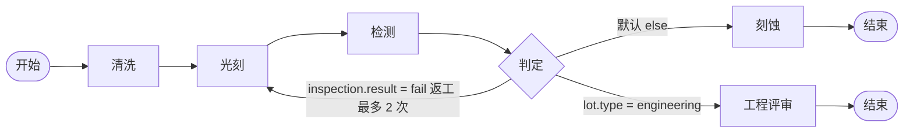

# 半导体 MES 系统设计文档

## 1. 系统概述 (System Overview)

本系统是一个面向半导体制造行业的MES（Manufacturing Execution System，制造执行系统），用于管理和追踪生产过程中的各个环节。

### 1.1 技术栈

- **前端 (Frontend)**: Soybean Admin 2.2.0（`github.com/soybeanjs/soybean-admin`）。保留其布局、主题、vue-i18n、elegant-router 与权限约定。`VITE_AUTH_ROUTE_MODE=dynamic`，菜单来自 `GET /api/v1/route/getUserRoutes`。按钮权限使用 `useAuth().hasAuth`，数据来自 `userInfo.buttons`。
- **后端 (Backend)**: Sponge v1.16.1（`github.com/go-dev-frame/sponge`）生成的 web 服务。入口 `server/cmd/mes`，按 model / dao / handler / routers 分层。基础表的 CRUD 由 `sponge web http` 生成，再补认证、RBAC、种子数据和双语错误信息。
- **数据库 (Database)**: 默认 SQLite。只改 `server/configs/mes.yml` 的 `database.driver`（`sqlite` | `mysql` | `postgresql`）即可切换，业务代码不写数据库方言 SQL。
- **认证 (Authentication)**: Sponge JWT（`Authorization: Bearer`）。登录体字段为 Soybean 的 `userName`。
- **授权 (Authorization)**: RBAC。`super_admin` 跳过权限校验，其余角色按菜单上的权限码校验。
- **国际化 (i18n)**: 前端 zh-CN / en-US。请求带 `Accept-Language`，后端错误文案按该头返回中文或英文。

### 1.2 架构原则

- **前后端分离**: 前端通过 HTTP JSON 与后端通信，响应为 `{code, msg, data}`，成功码为 `0`。
- **数据库无关**: GORM AutoMigrate + 生成代码，不写某一种数据库专用 SQL。
- **权限驱动**: 动态路由决定菜单，按钮权限码决定新增、编辑、删除是否显示；后端对同一权限码再校验一次。
- **国际化优先**: 页面文案走 Soybean 的 locale；接口失败提示走后端 `msg`。

状态字段在界面上使用 `1` 启用、`2` 停用。Sponge 生成的 DAO 更新会跳过数值 0，因此不用 `0` 表示停用。

## 2. 仓库结构 (Repository Layout)

```
semi-mes/
├── docs/design.md
├── server/                         # Sponge 生成的服务
│   ├── cmd/mes/                    # 进程入口
│   ├── configs/mes.yml             # 数据库、JWT、HTTP
│   ├── internal/
│   │   ├── model/                  # GORM 模型
│   │   ├── dao/                    # 数据访问
│   │   ├── handler/                # HTTP handler（含 auth）
│   │   ├── routers/                # 路由注册
│   │   ├── bootstrap/              # AutoMigrate 与种子数据
│   │   ├── rbac/                   # 按路径映射权限码
│   │   ├── i18n/
│   │   ├── database/               # sqlite / mysql / postgresql
│   │   └── config/
│   └── scripts/schema.sql          # 供 sponge CLI 读取的表结构
├── web/                            # Soybean Admin 2.2.0
│   ├── src/views/                  # 页面，文件路径即路由名
│   ├── src/service/api/            # 请求封装
│   ├── src/locales/langs/          # zh-cn.ts / en-us.ts
│   ├── src/router/elegant/         # elegant-router 生成物
│   └── .env / .env.test            # dynamic 路由与后端地址
├── Makefile
└── README.md
```

## 3. 数据模型设计 (Data Model)

### 3.1 系统管理模块 (System Management)

#### 3.1.1 用户表 (sys_user)

| 字段名 | 类型 | 说明 |
|--------|------|------|
| id | bigint | 主键ID |
| username | varchar(50) | 用户名，唯一 |
| password | varchar(255) | 密码（加密） |
| real_name | varchar(50) | 真实姓名 |
| email | varchar(100) | 邮箱 |
| phone | varchar(20) | 手机号 |
| status | tinyint | 状态：1-启用，0-禁用 |
| created_at | timestamp | 创建时间 |
| updated_at | timestamp | 更新时间 |
| deleted_at | timestamp | 软删除时间 |

#### 3.1.2 角色表 (sys_role)

| 字段名 | 类型 | 说明 |
|--------|------|------|
| id | bigint | 主键ID |
| role_code | varchar(50) | 角色编码，唯一 |
| role_name | varchar(50) | 角色名称 |
| description | varchar(255) | 角色描述 |
| status | tinyint | 状态：1-启用，0-禁用 |
| created_at | timestamp | 创建时间 |
| updated_at | timestamp | 更新时间 |
| deleted_at | timestamp | 软删除时间 |

#### 3.1.3 菜单/权限表 (sys_menu)

| 字段名 | 类型 | 说明 |
|--------|------|------|
| id | bigint | 主键ID |
| parent_id | bigint | 父菜单ID，0表示根菜单 |
| menu_type | tinyint | 类型：1-目录，2-菜单，3-按钮 |
| menu_name | varchar(50) | 菜单名称（i18n key） |
| permission_code | varchar(100) | 权限编码，如：base:factory:add |
| route_path | varchar(200) | 前端路由路径 |
| component_path | varchar(200) | 前端组件路径 |
| icon | varchar(50) | 图标 |
| sort_order | int | 排序号 |
| status | tinyint | 状态：1-启用，0-禁用 |
| created_at | timestamp | 创建时间 |
| updated_at | timestamp | 更新时间 |
| deleted_at | timestamp | 软删除时间 |

#### 3.1.4 用户-角色关联表 (sys_user_role)

| 字段名 | 类型 | 说明 |
|--------|------|------|
| id | bigint | 主键ID |
| user_id | bigint | 用户ID |
| role_id | bigint | 角色ID |
| created_at | timestamp | 创建时间 |

#### 3.1.5 角色-菜单关联表 (sys_role_menu)

| 字段名 | 类型 | 说明 |
|--------|------|------|
| id | bigint | 主键ID |
| role_id | bigint | 角色ID |
| menu_id | bigint | 菜单ID |
| created_at | timestamp | 创建时间 |

### 3.2 模块1：基础数据建模 (Base Data Modeling)

#### 3.2.1 工厂表 (base_factory)

| 字段名 | 类型 | 说明 |
|--------|------|------|
| id | bigint | 主键ID |
| factory_code | varchar(50) | 工厂编码，唯一 |
| factory_name | varchar(100) | 工厂名称 |
| address | varchar(255) | 地址 |
| contact | varchar(50) | 联系人 |
| phone | varchar(20) | 联系电话 |
| status | tinyint | 状态：1-启用，0-禁用 |
| created_at | timestamp | 创建时间 |
| updated_at | timestamp | 更新时间 |
| deleted_at | timestamp | 软删除时间 |

#### 3.2.2 车间/区域表 (base_workshop)

| 字段名 | 类型 | 说明 |
|--------|------|------|
| id | bigint | 主键ID |
| factory_id | bigint | 所属工厂ID |
| workshop_code | varchar(50) | 车间编码 |
| workshop_name | varchar(100) | 车间名称 |
| workshop_type | varchar(20) | 车间类型：FAB, TEST, ASSY |
| description | varchar(255) | 描述 |
| status | tinyint | 状态：1-启用，0-禁用 |
| created_at | timestamp | 创建时间 |
| updated_at | timestamp | 更新时间 |
| deleted_at | timestamp | 软删除时间 |

#### 3.2.3 生产线表 (base_production_line)

| 字段名 | 类型 | 说明 |
|--------|------|------|
| id | bigint | 主键ID |
| workshop_id | bigint | 所属车间ID |
| line_code | varchar(50) | 生产线编码 |
| line_name | varchar(100) | 生产线名称 |
| capacity | int | 产能（片/天） |
| description | varchar(255) | 描述 |
| status | tinyint | 状态：1-启用，0-禁用 |
| created_at | timestamp | 创建时间 |
| updated_at | timestamp | 更新时间 |
| deleted_at | timestamp | 软删除时间 |

#### 3.2.4 产品表 (base_product)

| 字段名 | 类型 | 说明 |
|--------|------|------|
| id | bigint | 主键ID |
| product_code | varchar(50) | 产品编码，唯一 |
| product_name | varchar(100) | 产品名称 |
| product_type | varchar(50) | 产品类型：IC, DISCRETE, SENSOR等 |
| version | varchar(20) | 版本号 |
| description | varchar(500) | 产品描述 |
| status | tinyint | 状态：1-启用，0-禁用 |
| created_at | timestamp | 创建时间 |
| updated_at | timestamp | 更新时间 |
| deleted_at | timestamp | 软删除时间 |

#### 3.2.5 工艺路线表 (base_process_route)

| 字段名 | 类型 | 说明 |
|--------|------|------|
| id | bigint | 主键ID |
| product_id | bigint | 产品ID |
| route_code | varchar(50) | 路线编码 |
| route_name | varchar(100) | 路线名称 |
| version | varchar(20) | 当前已发布版本号，发布时回写，页面不单独编辑 |
| is_default | tinyint | 是否默认路线：1-是，0-否 |
| description | varchar(500) | 描述 |
| status | tinyint | 状态：1-启用，0-禁用 |
| created_at | timestamp | 创建时间 |
| updated_at | timestamp | 更新时间 |
| deleted_at | timestamp | 软删除时间 |

#### 3.2.6 工序/操作表 (base_operation)

| 字段名 | 类型 | 说明 |
|--------|------|------|
| id | bigint | 主键ID |
| route_id | bigint | 遗留列，可空。工序是主数据，不再按路线排序 |
| operation_code | varchar(50) | 工序编码 |
| operation_name | varchar(100) | 工序名称 |
| operation_type | varchar(50) | 工序类型：PHOTO, ETCH, DEPOSITION, etc. |
| sequence | int | 遗留列。路线顺序改由流程图的边表达 |
| standard_time | int | 标准工时（分钟） |
| description | varchar(500) | 描述 |
| status | tinyint | 状态：1-启用，0-禁用 |
| created_at | timestamp | 创建时间 |
| updated_at | timestamp | 更新时间 |
| deleted_at | timestamp | 软删除时间 |

#### 3.2.7 配方表 (base_recipe)

| 字段名 | 类型 | 说明 |
|--------|------|------|
| id | bigint | 主键ID |
| operation_id | bigint | 所属工序ID |
| recipe_code | varchar(50) | 配方编码 |
| recipe_name | varchar(100) | 配方名称 |
| version | varchar(20) | 版本号 |
| parameters | text | 配方参数（JSON格式） |
| is_default | tinyint | 是否默认配方：1-是，0-否 |
| description | varchar(500) | 描述 |
| status | tinyint | 状态：1-启用，0-禁用 |
| created_at | timestamp | 创建时间 |
| updated_at | timestamp | 更新时间 |
| deleted_at | timestamp | 软删除时间 |

#### 3.2.8 工艺路线流程图

路线头 `base_process_route` 只描述编码、名称和所属产品。可执行的流程是带版本的有向图，不再使用工序上的 `sequence` 排序。

不设置并行分叉和汇合节点。一个 Lot 是一份物理在制，同一时刻只占据一个节点。需要两段工艺同时进行时，在模块 2 拆批，而不是让同一个 Lot 走两条边。条件分支用判定节点表达。



种子数据 `ROUTE-CMOS` 就是上图，版本 1 以已发布状态写入。失败返工回到光刻，超过 2 次则 Hold，不继续走该边。

##### 表

`base_route_version`：`route_id`、`version_no`、`state`（`draft` / `released` / `obsolete`）、`note`。同一路线同时只有一个 `released`。发布时把原先的 `released` 改为 `obsolete`。已发布和已作废的版本拒绝修改；要改就复制成新的草稿。Lot 绑定具体的 `version_id`，不随路线头飘移。

`base_route_node`：`node_key`、`node_type`（`start` / `end` / `operation` / `decision`）、`name`、`operation_id`、`recipe_id`、`equipment_group`、`pos_x`、`pos_y`。工序节点引用工序主数据。

`base_route_edge`：`edge_key`、`from_key`、`to_key`、`edge_kind`（`normal` / `rework`）、`is_default`、`priority`、`condition_json`、`max_rework`、`on_exceed`、`label`。返工边在图上用虚线区分。`on_exceed` 目前只有 `hold`。

这三张新表使用 GORM 的 `DeletedAt` 做软删除。Sponge 生成的旧模型仍是 `*time.Time`，删除仍是物理删除：改成 `gorm.DeletedAt` 会让生成的 sqlmock 用例按字段展开参数而失败，没有和流程图一起改。

##### 条件

条件是声明式 JSON，不执行代码。非默认边必须带条件，默认边必须为空，这样 Lot 在没有命中任何条件时仍有一条 else 可走。

```json
{"all":[{"field":"inspection.result","op":"eq","value":"fail"}]}
```

`all` 与 `any` 只能出现一个。字段白名单：

| 字段 | 类型 | 含义 |
|------|------|------|
| inspection.result | string | 出站检验，如 pass / fail |
| inspection.grade | string | 等级 |
| defect.code | string | 缺陷代码 |
| lot.productCode | string | 产品编码 |
| lot.priority | number | 优先级 |
| lot.type | string | production 或 engineering |
| rework.count | number | 这条返工边已经被走过的次数 |

比较符：字符串用 `eq` `ne` `in` `contains`；数字再用 `gt` `gte` `lt` `lte`。`in` 的值是数组。

##### 下一步

`routegraph.Resolve(graph, currentNodeKey, context)` 给后续 WIP 用。出边按 `priority` 从小到大检查，默认边最后。第一条命中的非默认边生效，否则走默认边。若选中的是返工边且 `rework.count >= max_rework`，结果是 `hold`，不跳转。当前节点已是结束时，结果是 `end`。`action` 为 `move`、`hold` 或 `end`，`reason` 为 `matched`、`default`、`rework_exceeded` 或 `already_end`。

##### 发布前校验

- 恰好一个开始节点，至少一个结束节点
- 开始没有入边，结束没有出边
- 从开始沿所有边能到达每个节点，每个非结束节点能到达某个结束
- 出边不少于两条时恰好一条默认边；只有一条出边时该边必须是默认边
- 判定节点至少两条出边
- 返工边的目标必须是上游（只沿普通边，目标能到达源），或回到自身；`max_rework >= 1`
- 去掉已设上限的返工边之后，剩余图必须是有向无环图
- 条件字段、比较符、取值类型都在白名单内；工序节点必须选择工序

##### 编辑器

前端使用 Vue Flow（`@vue-flow/core` 及 background、controls、minimap）和 `@dagrejs/dagre`。Vue Flow 是 Vue 3 组合式 API 的图编辑库，缩放、平移和自定义节点是内建的，比不以 Vue 为主的 AntV X6、LogicFlow 更贴 Soybean Admin。页面支持拖拽和按钮添加节点、连线、侧栏编辑工序/配方/设备组和边条件、自动布局、校验、保存草稿、发布，以及只读查看已发布版本。中英文和 `base:route` 的查询、新增、编辑权限一起生效。

### 3.3 模块2：工单和批次管理 (Work Order & Lot Management)

批次绑定已发布的 `route_version_id` 和 `current_node_key`。开批时当前节点是该版本的开始节点。离开当前节点时调用 3.2.8 的 Resolve，不在页面里另写一套分支规则。完整的 Track In / Track Out 仍属于后面的 WIP 模块；这里的「推进」是留给 WIP 的插口：传入检验上下文，写入履历，并按 Resolve 的结果移动、Hold 或完成。

工单状态：`created` → `released` → `in_progress` → `completed` → `closed`。只有 `created` 能改产品、路线版本和数量。下达后才能开批。第一批开出后进入 `in_progress`。已投放数量达到计划数量，且没有处于 waiting 或 hold 的批次时，工单变为 `completed`，之后才能关闭。

批次号为 `{工单号}-{三位序号}`，序号记在工单上，拆批也继续使用。批次状态：`waiting`、`hold`、`completed`、`merged`。

#### 3.3.1 工单表 (wip_work_order)

| 字段名 | 类型 | 说明 |
|--------|------|------|
| id | bigint | 主键 |
| order_no | varchar(40) | 工单号，唯一 |
| product_id | bigint | 产品 |
| route_version_id | bigint | 已发布的工艺路线版本 |
| planned_qty | int | 计划数量 |
| released_qty | int | 已投放数量 |
| completed_qty | int | 已完成数量 |
| next_lot_seq | int | 下一个批次序号 |
| priority | int | 1 低，2 中，3 高，4 紧急 |
| due_date | date | 交期 |
| status | varchar(20) | created / released / in_progress / completed / closed |
| note | text | 备注 |
| deleted_at | timestamp | 软删除 |

#### 3.3.2 批次表 (wip_lot)

| 字段名 | 类型 | 说明 |
|--------|------|------|
| id | bigint | 主键 |
| lot_no | varchar(50) | 批次号，唯一 |
| order_id | bigint | 工单 |
| product_id | bigint | 产品 |
| route_version_id | bigint | 绑定的路线版本，开批后不变 |
| current_node_key | varchar(64) | 当前节点 |
| quantity | int | 当前数量 |
| priority | int | 开批时从工单复制 |
| lot_type | varchar(20) | production 或 engineering，供 Resolve 使用 |
| status | varchar(20) | waiting / hold / completed / merged |
| hold_reason_code | varchar(50) | Hold 原因代码 |
| hold_reason | varchar(255) | Hold 说明 |
| rework_json | text | 各返工边已走过的次数，Resolve 读取 |
| deleted_at | timestamp | 软删除 |

#### 3.3.3 履历 (wip_lot_history)

记录 start、advance、hold、release、split、merge、complete。字段包含 from/to 节点、边、原因代码、数量和关联批次。这张表是 WIP Track In/Out 之前的履历，不替代以后的 `wip_move_history`。

#### 3.3.4 谱系 (wip_lot_link)

| 字段名 | 说明 |
|--------|------|
| parent_lot_id / child_lot_id | 拆批时母批是 parent；合批时被并入的批次是 parent，留下的批次是 child |
| link_type | split 或 merge |
| quantity | 这次拆出或并入的数量 |

拆批只允许 waiting，子批数量之和必须小于母批，母批留下余数，子批停在同一节点并复制返工次数。合批要求同一工单、同一路线版本、同一当前节点，且都是 waiting。被并入的批次状态改为 merged，数量归零。

返工次数达到上限时，Resolve 返回 Hold，批次停在当前节点，原因代码 `REWORK_LIMIT`。解除 Hold 只恢复 waiting，不移动节点。

### 3.4 模块3：WIP跟踪 (WIP Tracking)

#### 3.4.1 流转历史表 (wip_move_history)

| 字段名 | 类型 | 说明 |
|--------|------|------|
| id | bigint | 主键ID |
| lot_id | bigint | 批次ID |
| operation_id | bigint | 工序ID |
| move_type | varchar(20) | 类型：TRACK_IN, TRACK_OUT |
| equipment_id | bigint | 设备ID |
| operator_id | bigint | 操作员ID |
| quantity_in | int | 进站数量 |
| quantity_out | int | 出站数量 |
| move_time | timestamp | 流转时间 |
| created_at | timestamp | 创建时间 |

### 3.5 模块4：设备管理 (Equipment Management)

#### 3.5.1 设备台账表 (eqp_equipment)

| 字段名 | 类型 | 说明 |
|--------|------|------|
| id | bigint | 主键ID |
| equipment_code | varchar(50) | 设备编码，唯一 |
| equipment_name | varchar(100) | 设备名称 |
| line_id | bigint | 所属生产线ID |
| equipment_type | varchar(50) | 设备类型 |
| model | varchar(50) | 型号 |
| manufacturer | varchar(100) | 厂商 |
| install_date | date | 安装日期 |
| status | varchar(20) | 状态：IDLE, RUNNING, DOWN, PM, MAINTENANCE |
| created_at | timestamp | 创建时间 |
| updated_at | timestamp | 更新时间 |
| deleted_at | timestamp | 软删除时间 |

#### 3.5.2 预防性维护表 (eqp_pm_plan)

| 字段名 | 类型 | 说明 |
|--------|------|------|
| id | bigint | 主键ID |
| equipment_id | bigint | 设备ID |
| pm_type | varchar(50) | PM类型：DAILY, WEEKLY, MONTHLY, QUARTERLY |
| pm_name | varchar(100) | PM名称 |
| interval_days | int | 间隔天数 |
| last_pm_date | date | 上次PM日期 |
| next_pm_date | date | 下次PM日期 |
| status | tinyint | 状态：1-启用，0-禁用 |
| created_at | timestamp | 创建时间 |
| updated_at | timestamp | 更新时间 |
| deleted_at | timestamp | 软删除时间 |

### 3.6 模块5：质量管理 (Quality Management)

#### 3.6.1 检验记录表 (qc_inspection)

| 字段名 | 类型 | 说明 |
|--------|------|------|
| id | bigint | 主键ID |
| inspection_no | varchar(50) | 检验单号，唯一 |
| lot_id | bigint | 批次ID |
| operation_id | bigint | 工序ID |
| inspection_type | varchar(20) | 检验类型：IQC, PQC, FQC, OQC |
| inspector_id | bigint | 检验员ID |
| sample_size | int | 抽样数量 |
| defect_count | int | 不良数量 |
| result | varchar(20) | 结果：PASS, FAIL, PENDING |
| inspection_time | timestamp | 检验时间 |
| created_at | timestamp | 创建时间 |
| updated_at | timestamp | 更新时间 |

#### 3.6.2 缺陷记录表 (qc_defect)

| 字段名 | 类型 | 说明 |
|--------|------|------|
| id | bigint | 主键ID |
| inspection_id | bigint | 检验记录ID |
| defect_code | varchar(50) | 缺陷代码 |
| defect_name | varchar(100) | 缺陷名称 |
| defect_count | int | 缺陷数量 |
| severity | varchar(20) | 严重性：CRITICAL, MAJOR, MINOR |
| description | varchar(500) | 描述 |
| created_at | timestamp | 创建时间 |

### 3.7 ER关系图

```
[sys_user] 1---N [sys_user_role] N---1 [sys_role]
[sys_role] 1---N [sys_role_menu] N---1 [sys_menu]

[base_factory] 1---N [base_workshop] 1---N [base_production_line]
[base_product] 1---N [base_process_route] 1---N [base_operation] 1---N [base_recipe]

[wip_work_order] 1---N [wip_lot]
[base_product] 1---N [wip_work_order]
[base_route_version] 1---N [wip_work_order]
[base_route_version] 1---N [wip_lot]
[wip_lot] 1---N [wip_lot_history]
[wip_lot] 1---N [wip_lot_link]
[wip_lot] 1---N [wip_move_history]

[base_production_line] 1---N [eqp_equipment]
[eqp_equipment] 1---N [eqp_pm_plan]
[eqp_equipment] 1---N [wip_move_history]

[wip_lot] 1---N [qc_inspection]
[qc_inspection] 1---N [qc_defect]
```

## 4. API设计规范 (API Conventions)

### 4.1 RESTful接口规范

- **基础路径**: `/api/v1`
- **认证**: 使用 `Authorization: Bearer <token>` Header
- **命名规则**: 与 Sponge 生成代码一致，资源名为驼峰，例如 `/api/v1/baseFactory`。创建为 `POST /资源`，更新 `PUT /资源/:id`，删除 `DELETE /资源/:id`，详情 `GET /资源/:id`，分页列表为 `POST /资源/list`。

### 4.2 统一响应格式

#### 成功响应
```json
{
  "code": 0,
  "msg": "ok",
  "data": {
    // 业务数据
  }
}
```

#### 错误响应
```json
{
  "code": 40001,
  "msg": "用户名或密码错误",
  "data": {}
}
```

#### 分页响应
```json
{
  "code": 0,
  "msg": "ok",
  "data": {
    "baseFactorys": [],
    "total": 100
  }
}
```

### 4.3 错误码设计

| 错误码 | 说明 |
|--------|------|
| 0 | 成功 |
| 40001 | 认证失败 |
| 40003 | 权限不足 |
| 40004 | 资源不存在 |
| 40009 | 参数错误 |
| 50000 | 服务器内部错误 |

### 4.4 主要API端点

列表请求体为 `{ "page": 0, "limit": 10, "columns": [{ "name": "factory_name", "exp": "like", "value": "%Fab%", "logic": "and" }] }`。`page` 从 0 开始。列表字段名是生成代码的复数形式，例如 `baseFactorys`、`baseWorkshops`、`baseProductionLines`、`baseProducts`、`baseProcessRoutes`、`baseOperations`、`baseRecipes`、`sysUsers`、`sysRoles`、`sysMenus`。JSON 字段为驼峰，外键以 `ID` 结尾，如 `factoryID`。

#### 4.4.1 认证与动态路由
- `POST /api/v1/auth/login` 请求 `{userName, password}`，返回 `{token, refreshToken}`
- `POST /api/v1/auth/refreshToken`
- `GET /api/v1/auth/getUserInfo` 返回 `{userId, userName, roles, buttons}`
- `GET /api/v1/route/getConstantRoutes` 登录前可访问
- `GET /api/v1/route/getUserRoutes` 返回 `{routes, home}`，`routes` 为 elegant-router 路由树
- `GET /api/v1/route/isRouteExist`

#### 4.4.2 系统管理
每个资源都有创建、按 id 查询、更新、删除，以及 `POST /list`：
- `/api/v1/sysUser`，另有 `GET|PUT /api/v1/sysUser/:id/roles`，体为 `{roleIds}`
- `/api/v1/sysRole`，另有 `GET|PUT /api/v1/sysRole/:id/menus`，体为 `{menuIds}`
- `/api/v1/sysMenu`
- `/api/v1/sysUserRole`、`/api/v1/sysRoleMenu` 为关联表的生成接口，页面优先使用上面的 roles/menus 接口

#### 4.4.3 基础数据（模块1）
同样是创建、查询、更新、删除和 `POST /list`：
- `/api/v1/baseFactory`
- `/api/v1/baseWorkshop`
- `/api/v1/baseProductionLine`
- `/api/v1/baseProduct`
- `/api/v1/baseProcessRoute`
- `/api/v1/baseOperation`（工序主数据，不要求隶属某条路线）
- `/api/v1/baseProcessRoute/:id/versions` 列出版本、创建草稿（可 `copyFrom`）
- `/api/v1/baseProcessRoute/:id/versions/:versionId` 读取流程图
- `PUT .../graph` 整体替换草稿的节点和边
- `POST .../validate`、`POST .../release`
- `POST .../resolve` 给定当前节点和批次上下文，返回下一步
- `/api/v1/baseRecipe`

#### 4.4.4 工单与批次（模块2）

权限前缀是 `wo:order` 和 `lot:lot`，仍按查询、新增、编辑、删除拆按钮。开批、Hold、解除 Hold、拆批、合批、推进都要编辑权限。

- `POST /api/v1/wipWorkOrder/list`，列表键 `wipWorkOrders`
- `GET /api/v1/wipWorkOrder/releasedVersions` 已发布且可绑定的路线版本
- `POST|PUT|DELETE /api/v1/wipWorkOrder` 与 `/:id`
- `POST /api/v1/wipWorkOrder/:id/release`、`/close`、`/start`。开批体为 `{quantity, lotType}`
- `POST /api/v1/wipLot/list`，列表键 `wipLots`
- `GET /api/v1/wipLot/:id` 返回批次、履历、谱系和流程图节点边
- `POST /api/v1/wipLot/:id/hold`、`/releaseHold`、`/split`、`/advance`
- `POST /api/v1/wipLot/merge`，体为 `{targetId, sourceIds}`。推进体为 `{inspectionResult, inspectionGrade, defectCode}`，批次类型、优先级、产品和返工次数由服务端从批次本身填入 Resolve

## 5. 国际化方案 (i18n Approach)

### 5.1 前端国际化

使用 `vue-i18n` 实现前端国际化：

```typescript
// locales/zh-CN.ts
export default {
  menu: {
    dashboard: '仪表板',
    baseData: '基础数据',
    factory: '工厂管理',
    workshop: '车间管理',
    // ...
  },
  baseData: {
    factory: {
      title: '工厂管理',
      code: '工厂编码',
      name: '工厂名称',
      // ...
    }
  }
}

// locales/en-US.ts
export default {
  menu: {
    dashboard: 'Dashboard',
    baseData: 'Base Data',
    factory: 'Factory',
    workshop: 'Workshop',
    // ...
  },
  baseData: {
    factory: {
      title: 'Factory Management',
      code: 'Factory Code',
      name: 'Factory Name',
      // ...
    }
  }
}
```

### 5.2 后端国际化

后端读取 `Accept-Language`。包含 `en` 时 `msg` 为英文，否则为简体中文。Soybean 直接展示 `msg`。

### 5.3 菜单国际化

菜单的 `meta.i18nKey` 为 `route.<路由名>`，例如 `route.base-data_factory`。文案在 `web/src/locales/langs/zh-cn.ts` 与 `en-us.ts` 的 `route` 中。

## 6. 数据库切换方案 (Database Switching)

### 6.1 配置文件

实际文件是 `server/configs/mes.yml`。只改 `database.driver`：

```yaml
database:
  driver: sqlite   # sqlite | mysql | postgresql
  sqlite:
    dbFile: data/mes.db
  mysql:
    dsn: "root:password@(127.0.0.1:3306)/mes?parseTime=true&loc=Local&charset=utf8mb4&collation=utf8mb4_general_ci"
  postgresql:
    dsn: "postgres:password@127.0.0.1:5432/mes?sslmode=disable"
```

### 6.2 数据库连接代码

```go
func InitDB(cfg *Config) (*gorm.DB, error) {
    var dialector gorm.Dialector
    
    switch cfg.Database.Type {
    case "sqlite":
        dialector = sqlite.Open(cfg.Database.SQLite.Path)
    case "mysql":
        dsn := fmt.Sprintf("%s:%s@tcp(%s:%d)/%s?charset=%s&parseTime=True&loc=Local",
            cfg.Database.MySQL.Username,
            cfg.Database.MySQL.Password,
            cfg.Database.MySQL.Host,
            cfg.Database.MySQL.Port,
            cfg.Database.MySQL.Database,
            cfg.Database.MySQL.Charset,
        )
        dialector = mysql.Open(dsn)
    case "postgres":
        dsn := fmt.Sprintf("host=%s port=%d user=%s password=%s dbname=%s sslmode=%s",
            cfg.Database.Postgres.Host,
            cfg.Database.Postgres.Port,
            cfg.Database.Postgres.Username,
            cfg.Database.Postgres.Password,
            cfg.Database.Postgres.Database,
            cfg.Database.Postgres.SSLMode,
        )
        dialector = postgres.Open(dsn)
    default:
        return nil, fmt.Errorf("unsupported database type: %s", cfg.Database.Type)
    }
    
    return gorm.Open(dialector, &gorm.Config{})
}
```

### 6.3 数据库无关SQL

- 使用GORM的Model方法，避免手写SQL
- 时间字段使用`time.Time`类型，由GORM自动转换
- 避免使用数据库特定函数（如MySQL的`GROUP_CONCAT`）
- 使用GORM的AutoMigrate进行数据库迁移

## 7. RBAC权限控制

### 7.1 权限模型

采用标准RBAC模型：
- 用户 (User) → 角色 (Role) → 权限 (Permission)
- 权限以菜单/按钮的形式存在
- 权限编码格式：`模块:功能:操作`，如 `base:factory:add`

### 7.2 后端权限检查

使用中间件检查API权限：

```go
func RequirePermission(permission string) gin.HandlerFunc {
    return func(c *gin.Context) {
        userID := c.GetInt64("user_id")
        hasPermission := checkUserPermission(userID, permission)
        if !hasPermission {
            c.JSON(403, Response{
                Code: 40003,
                Message: "error.auth.insufficient_permission",
            })
            c.Abort()
            return
        }
        c.Next()
    }
}

// 路由定义
router.POST("/api/v1/base-data/factories", 
    middleware.RequireAuth(),
    middleware.RequirePermission("base:factory:add"),
    handler.CreateFactory,
)
```

### 7.3 前端权限控制

- 菜单：通过后端接口获取当前用户可访问的菜单树，动态生成路由
- 按钮：Soybean 的 `useAuth().hasAuth('base:factory:add')`，权限码来自 `getUserInfo` 的 `buttons`。

## 8. 开发和部署

### 8.1 开发环境

```bash
# 后端需要 CGO（sqlite）。Go 1.24。在 server 目录：
make run

# 前端是 pnpm workspace。开发脚本使用 test 模式，读取 web/.env.test
cd web
pnpm install
pnpm dev
```

`server` 的 `make build` 使用 `CGO_ENABLED=0`，不能链接 SQLite。本地 SQLite 用 `make run`。

### 8.2 生产环境

```bash
# 构建后端
cd server
make build

# 构建前端
cd web
npm run build

# 使用Docker部署
docker-compose up -d
```

## 9. 初始数据

### 9.1 默认管理员

- 用户名: `admin`
- 密码: `admin123`
- 角色: 超级管理员

### 9.2 默认角色

- 超级管理员 (super_admin): 拥有所有权限
- 系统管理员 (sys_admin): 拥有系统管理权限
- 操作员 (operator): 拥有基础数据录入权限
- 只读用户 (viewer): 只有查看权限

### 9.3 菜单权限树

```
仪表板 (dashboard)
系统管理 (system)
  ├── 用户管理 (system:user)
  │   ├── 查询 (system:user:query)
  │   ├── 新增 (system:user:add)
  │   ├── 编辑 (system:user:edit)
  │   └── 删除 (system:user:delete)
  ├── 角色管理 (system:role)
  │   ├── 查询 (system:role:query)
  │   ├── 新增 (system:role:add)
  │   ├── 编辑 (system:role:edit)
  │   └── 删除 (system:role:delete)
  └── 菜单管理 (system:menu)
      ├── 查询 (system:menu:query)
      ├── 新增 (system:menu:add)
      ├── 编辑 (system:menu:edit)
      └── 删除 (system:menu:delete)
基础数据 (baseData)
  ├── 工厂管理 (base:factory)
  │   ├── 查询 (base:factory:query)
  │   ├── 新增 (base:factory:add)
  │   ├── 编辑 (base:factory:edit)
  │   └── 删除 (base:factory:delete)
  ├── 车间管理 (base:workshop)
  │   ├── 查询 (base:workshop:query)
  │   ├── 新增 (base:workshop:add)
  │   ├── 编辑 (base:workshop:edit)
  │   └── 删除 (base:workshop:delete)
  ├── 生产线管理 (base:line)
  │   ├── 查询 (base:line:query)
  │   ├── 新增 (base:line:add)
  │   ├── 编辑 (base:line:edit)
  │   └── 删除 (base:line:delete)
  ├── 产品管理 (base:product)
  │   ├── 查询 (base:product:query)
  │   ├── 新增 (base:product:add)
  │   ├── 编辑 (base:product:edit)
  │   └── 删除 (base:product:delete)
  ├── 工艺路线管理 (base:route)
  │   ├── 查询 (base:route:query)
  │   ├── 新增 (base:route:add)
  │   ├── 编辑 (base:route:edit)
  │   └── 删除 (base:route:delete)
  ├── 工序管理 (base:operation)
  │   ├── 查询 (base:operation:query)
  │   ├── 新增 (base:operation:add)
  │   ├── 编辑 (base:operation:edit)
  │   └── 删除 (base:operation:delete)
  └── 配方管理 (base:recipe)
      ├── 查询 (base:recipe:query)
      ├── 新增 (base:recipe:add)
      ├── 编辑 (base:recipe:edit)
      └── 删除 (base:recipe:delete)
工单管理 (workOrder)
  └── 工单列表 (wo:order)
      ├── 查询 (wo:order:query)
      ├── 新增 (wo:order:add)
      ├── 编辑 (wo:order:edit)
      └── 删除 (wo:order:delete)
批次管理 (lot)
  ├── 批次列表 (lot:lot)
  │   ├── 查询 (lot:lot:query)
  │   ├── 新增 (lot:lot:add)
  │   └── 编辑 (lot:lot:edit)
  └── 批次详情 (lot_detail，菜单隐藏)
WIP跟踪 (wip) - 待实现
  └── 流转记录 (wip:move:query)
设备管理 (equipment) - 待实现
  └── 设备台账 (eqp:equipment:query)
质量管理 (quality) - 待实现
  └── 检验记录 (qc:inspection:query)
```

## 10. 技术要点

### 10.1 后端技术要点

1. **Sponge CLI**：`sponge web http` 按表生成 model、dao、handler、router。表结构来源是 `server/scripts/schema.sql`。
2. **JWT**：使用 Sponge 的 `pkg/jwt` 与 `middleware.Auth`。
3. **GORM**：通过 `database.driver` 切换 sqlite、mysql、postgresql。
4. **Gin**：Sponge 的 HTTP 层。
5. **配置**：`configs/mes.yml`。
6. **种子数据**：首次启动 AutoMigrate，并写入管理员、角色和菜单。默认账号 `admin` / `admin123`。

### 10.2 前端技术要点

1. **Soybean Admin**：基于Vue 3的现代化管理后台模板
2. **Naive UI**：Vue 3组件库
3. **Pinia**：Vue 3状态管理
4. **TypeScript**：类型安全
5. **Vue Router**：路由管理，支持动态路由
6. **Axios**：HTTP客户端
7. **vue-i18n**：国际化
8. **UnoCSS**：原子化CSS

## 11. 后续开发计划

### 阶段1：基础架构（本次完成）
- ✅ 设计文档
- ✅ 项目脚手架
- ✅ RBAC系统
- ✅ 模块1：基础数据建模

### 阶段2：工单和批次管理（本次完成到可开批、拆合批和按路线推进）
- ✅ 工单创建、下达、关闭
- ✅ 按 `{工单号}-{序号}` 开批，绑定已发布路线版本和开始节点
- ✅ 拆批、合批和谱系
- ✅ Hold / 解除 Hold
- ✅ 用 Resolve 推进，并在批次详情里标出当前位置
- 未做：完整 Track In / Track Out、设备、不良录入页面。推进接口就是后续 WIP 的插口

### 阶段3：WIP跟踪
- Track In/Track Out
- 流转历史查询
- 在制品报表

### 阶段4：设备管理
- 设备台账
- 设备状态监控
- PM计划和执行

### 阶段5：质量管理
- 检验计划
- 检验记录
- 缺陷分析
- SPC控制图

### 阶段6：报表和看板
- 生产进度看板
- WIP统计
- 质量分析报表
- 设备稼动率

## 12. 参考资料

- [Sponge文档](https://github.com/go-dev-frame/sponge)
- [Soybean Admin文档](https://github.com/soybeanjs/soybean-admin)
- [GORM文档](https://gorm.io/)
- [Gin文档](https://gin-gonic.com/)
- [Naive UI文档](https://www.naiveui.com/)
